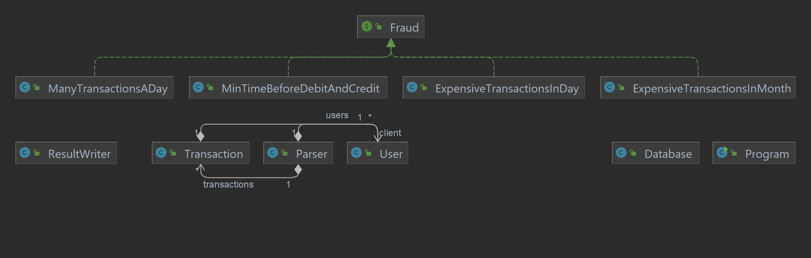
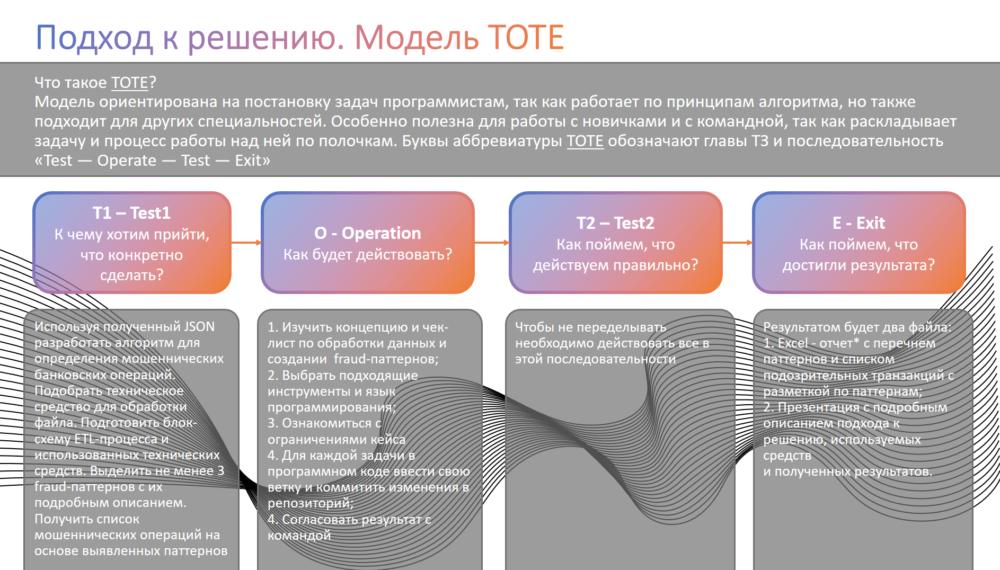
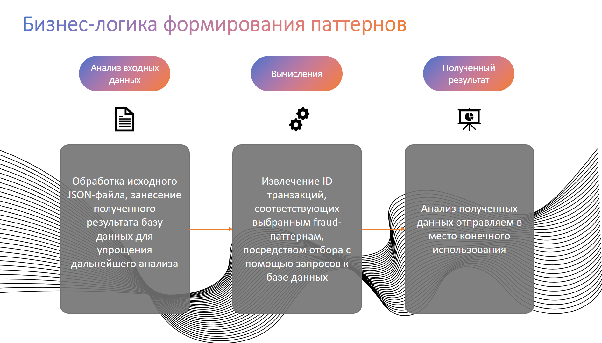
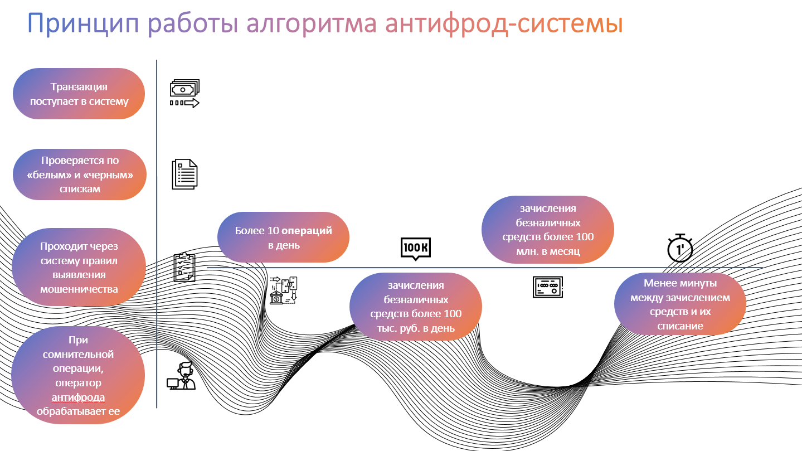
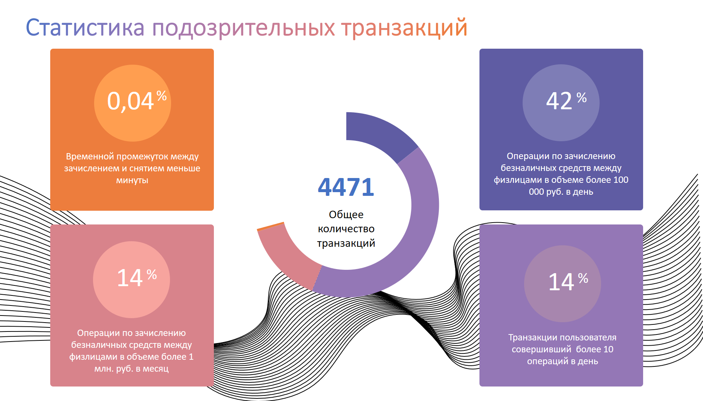

# Алгоритм определения мошеннических банковских операций

В банковской сфере **Фрод (Fraud)** — это проведение мошеннических (неправомерных) операций с использованием
банковских карт без ведома их владельцев.   
В таких случаях убытки несет и покупатель, и продавец, так как теряет товары, купленные фродером и сумму
за комиссию при переводе платежа. Дополнительно, продавцу придетсяплатить комиссию за возврат денег
и компенсировать расходы на расследование.

## Постановка задачи

**ЦЕЛЬ:** Используя полученный JSON - файл с банковскими транзакциями реализовать
алгоритм выявления мошеннических операций:
1. Подобрать техническое средство для обработки файла;
2. Подготовить блок-схему ETL-процесса с описанием функциональных компонентов,
   этапов преобразования данных и использованных технических средств;
3. Выделить не менее 3 fraud-паттернов с их подробным описанием;
4. Получить список мошеннических операций на основе выявленных паттернов.

## Диаграмма классов

---

---

---

---

---
