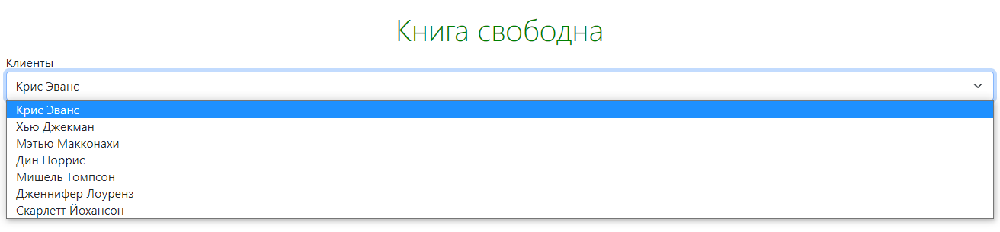
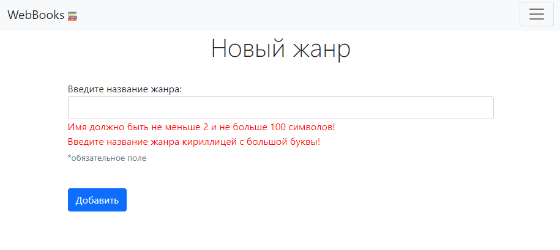
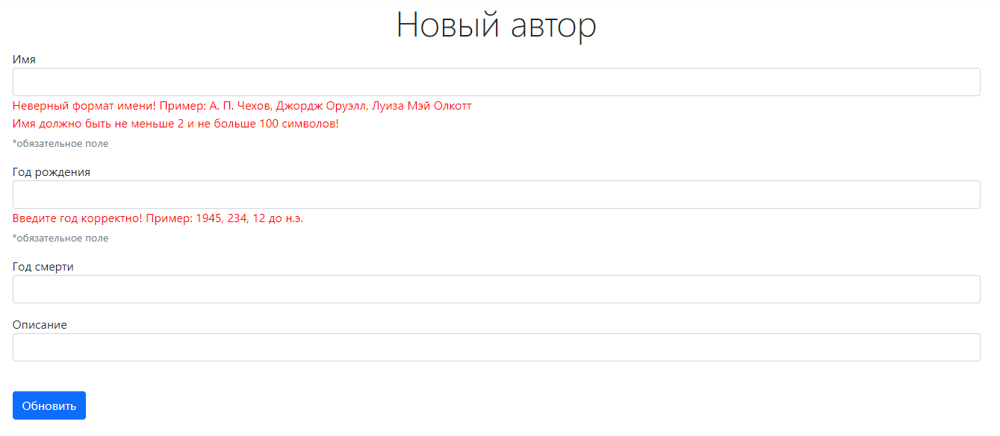
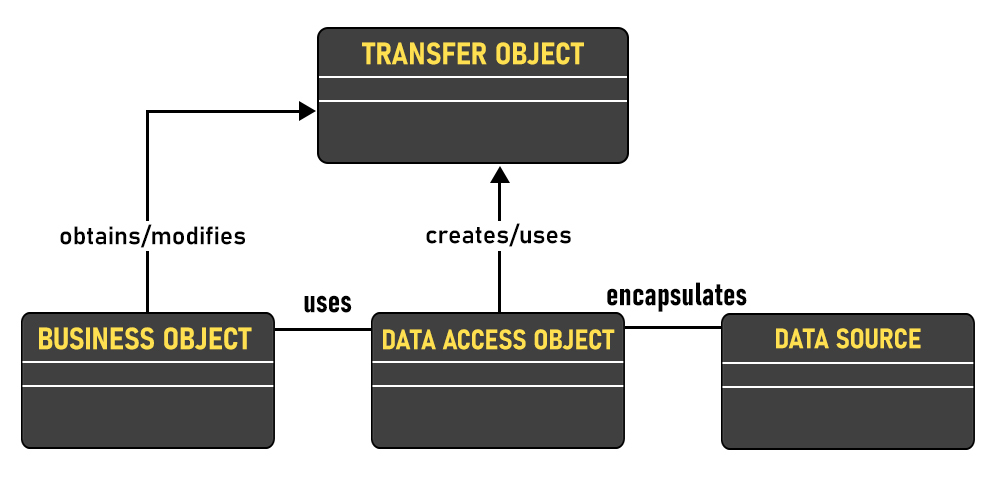

[//]: # (Todo: долго грузятся гиф)
# WebBooks 📚
Веб-приложение для библиотечной логистики, система контроля всех этапов работы цифровой библиотеки (работа с позициями 
а складе, менеджмент клиентов и прочее)

## Содержание

- [Запуск приложения](#start)
- [Реализованный функционал](#functions)
- [Архитектура приложения](#architecture)
- [Стек технологий](#tech)

<a name="start"></a>

## Запуск веб-приложения локально:

**WebBooks** - Spring Boot приложение, сборка осуществляется при помощи Maven.
Собрать jar файл и запустить его с помощью командной строки можно следующими командами:
```
git clone git@github.com:CreativeWex/WebBooks.git
cd WebBooks
./mvnw package
java -jar target/*.jar
```
Или вы можете запустить его из Maven напрямую, используя Spring Boot Maven plugin:
```
./mvnw spring-boot:run
```

## Конфигурация базы данных

Файл конфигурации располагается по пути `src/main/resources/application.properties`

```java
DB.driver=Дравер_БД
DB.url=URL_БД
DB.user=Юзер
DB.password=Пароль
```
`src/main/resources/data.sql` содержит демо-данные для БД.

<a name="functions"></a>

# Реализованный функционал

- [раздел "Заказы"](#orders);
- [раздел "Жанры"](#genres);
- [раздел "Авторы"](#authors);

---

<a name=orders></a>

# Заказы

На странице книги, если книга свободна, появляется выпадающий список клиентов
и кнопка `Забронировать книгу`. Эта кнопка нажимается библиотекарем когда читатель хочет
забрать эту книгу. После нажатия на эту кнопку, книга начинает принадлежать выбранному клиенту и пояевляется в его списке книг.

_Книга свободна_



_Книга занята_


Страница, на которой отображается **таблица клиентов и книг**, которые они взяли. Все записи в
таблице кликабельны и ведут на соответствующие страницы. Кнопка `Освободить` нажимается библиотекарем тогда, когда читатель
возвращает книгу обратно в библиотеку. После нажатия на кнопку книга снова
становится свободной, пропадает из списка взятых клиентом книг. 


---

<a name=genres></a>

# Жанры

1) **Страница со списком всех жанров**. Каждая строка кликабельна - при клике осуществляется переход на страницу жанра.
На странице расположена кнопка `Новый жанр` для создания нового жанра.

2) **Страница конкретного жанра**, на которой отображаются счетчик людей, добавивших данный
жанр в "свои любимые" и кликабельный список книг в библиотеке с данным жанром (книги, взятые клиентами
подсвечиваются красным цветом). Кнопки `Редактировать` и `Удалить жанр` перенаправляют на
соответствующие разделы


Если в библиотеке нет книг в данном жанре, вместо списка отображается
надпись _"Нет ни одной книги с этим жанром"_.

### Форма создания нового / редактирования существующего жанра. 

Поля валидируются с помощью `@Valid` и `Spring Validator` для отсутсвия повторяющихся записей



---

<a name="authors"></a>

# Авторы

1) **Страница со списком всех авторов**. Каждая строка кликабельна - при клике осуществляется переход на страницу автора.
   На странице расположена кнопка `Новый автор` для создания нового автора.

2) **Страница конкретного автора**, на которой отображается кликабельный список книг данного автора
Кнопки `Редактировать` и `Удалить автора` перенаправляют на соответствующие разделы.

Если не указывать дату смерти автора, то вместо нее появляется надпись _по настоящее время_.

Если не заполнять обязательные поля, рядом с ними появляется кнопка `Заполнить`.


### Форма создания нового / редактирования существующего автора.

Поля валидируются с помощью `@Valid` и `Spring Validator` для отсутсвия повторяющихся записей



--- 

<a name="architecture"></a>

## Архитектура приложения

При разработке использовался шаблон проектирования Model-View-Control


Взаимодействие с базой данных осуществляется при помощи шаблона Data Access Object



<a name="tech"></a>

# Стек технологий

Backend:
- Java
- Spring Boot, Spring MVC
- PostgreSQL, JdbcTemplate
- Maven
- Lombok
- Thymeleaf

Frontend:
- HTML 5
- Bootstrap 5

<a href="https://www.flaticon.com/free-icons/book" title="book icons">Icons created by Good Ware - Flaticon</a>
